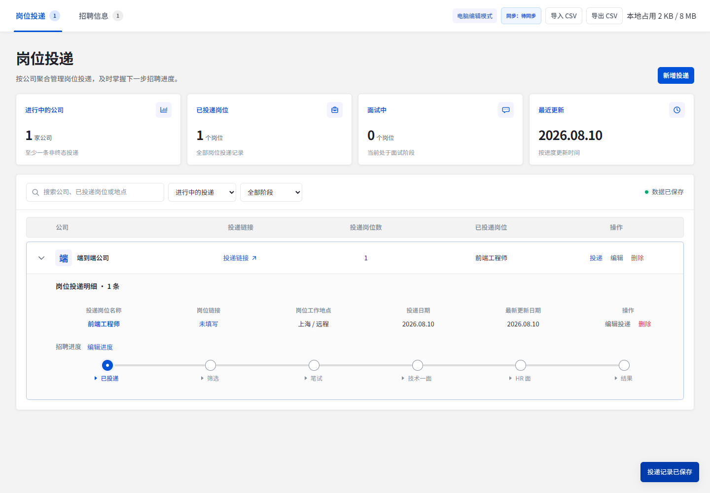
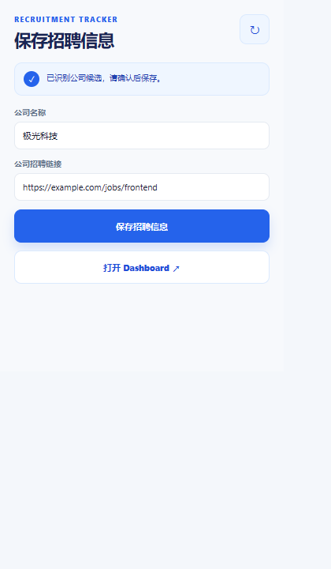
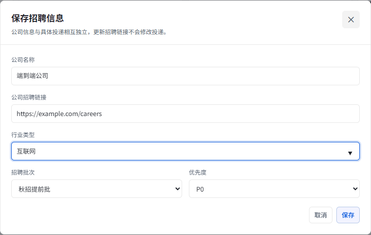
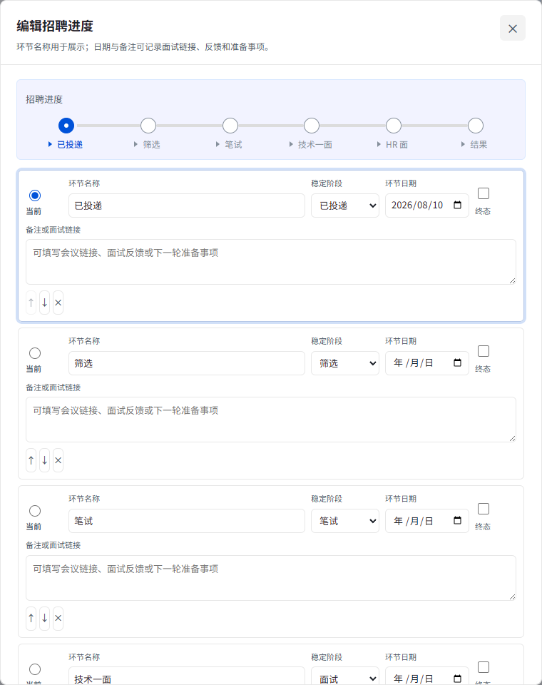
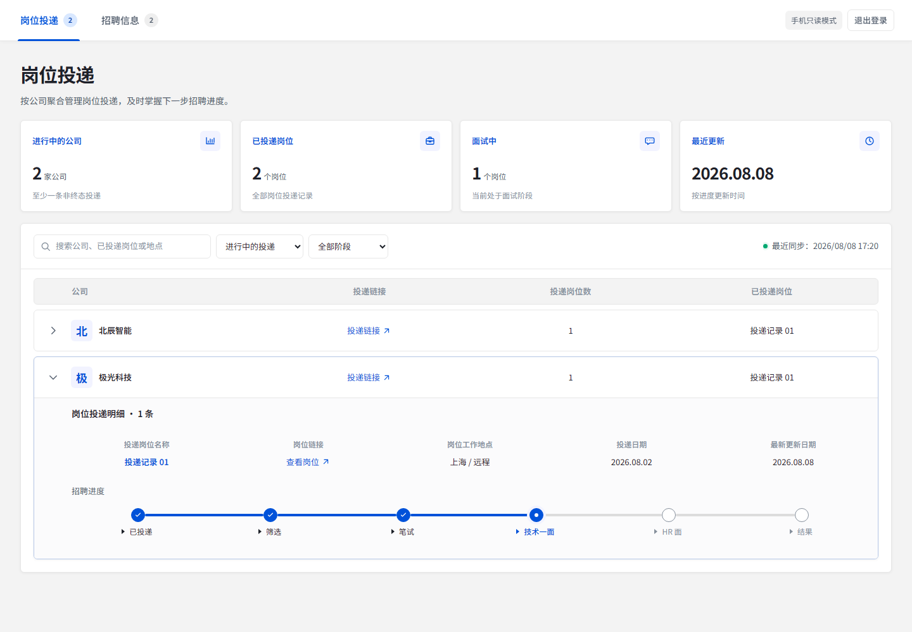
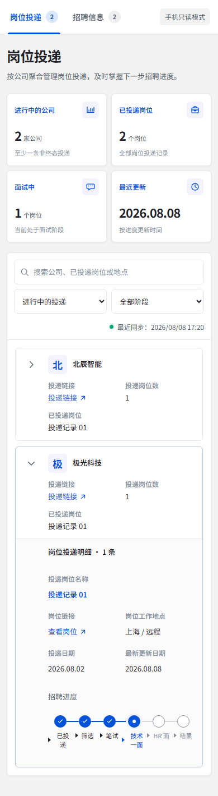

# Recruitment Tracker

面向个人使用的求职跟踪器。电脑端 Chrome 扩展负责从招聘页面采集公司信息、维护公司与岗位投递、编辑招聘进度并保存到本地；CloudBase 只保存最近一次完整快照，手机 Web 登录后以只读方式查看。

## 先了解产品边界

| 入口 | 用途 | 是否可编辑 |
| --- | --- | --- |
| Chrome 扩展 Popup | 从当前招聘页面识别并保存公司招聘信息 | 是 |
| Chrome 扩展 Dashboard | 管理公司、岗位投递、招聘进度、CSV 与同步 | 是 |
| 手机 / 浏览器 Web Dashboard | 查看最近一次 CloudBase 快照、搜索、筛选和展开详情 | 否 |

数据流如下：

```text
招聘页面
  ↓
Chrome 扩展 Popup
  ↓
chrome.storage.local（唯一可编辑主数据源）
  ↓
扩展 Dashboard
  ↓ 登录后同步
CloudBase user_snapshots（只保留最近一次完整快照）
  ↓
手机 Web Dashboard（只读）
```

手机端不会把云端数据写回电脑，也不提供新增、编辑、删除、CSV 导入或同步上传。

## 运行时界面

以下截图来自当前代码实际构建后的 Chromium 运行结果，示例数据仅用于展示操作路径。

### 电脑端 Dashboard：岗位投递与进度时间线



### 扩展 Popup：从招聘页面保存公司

打开招聘页面后点击扩展图标，会先显示 Popup。确认公司名称和招聘链接后，点击“保存招聘信息”；Popup 只保存公司，不会自动创建岗位投递。



### 编辑公司招聘信息

在“招聘信息”页点击“新增公司”，或者在已有公司行点击“编辑”，会打开下面的表单。行业类型、招聘批次和优先度在这里维护。



### 编辑招聘进度

在岗位投递详情中点击“编辑进度”，可以设置当前环节、稳定阶段、日期、终态和备注；备注也可记录面试链接或反馈。



### 桌面 Web 只读 Dashboard



### 手机 Web 只读 Dashboard



## 安装和启动

### 直接使用已发布的 Web

当前只读 Web 地址：

<https://recruitment-tracker-recuriment-tracker-d4cx9a1dc6d69.webapps.tcloudbase.com/>

Web 使用 CloudBase 管理端预先创建的用户名和密码登录，不提供注册、找回密码或手机端编辑入口。

### 安装 Chrome 扩展

仓库已提供发布包：`release/recruitment-tracker-extension-0.1.2.zip`。

1. 解压扩展压缩包，确认解压目录中直接包含 `manifest.json`。
2. 打开 Chrome 的 `chrome://extensions`。
3. 开启右上角“开发者模式”。
4. 点击“加载已解压的扩展程序”，选择刚才的解压目录。
5. 在扩展详情中确认扩展 ID 为 `jpmabplkjdmlfjpllogjaieehdohkndg`。
6. 点击扩展图标，打开 Popup；需要完整管理数据时点击“打开 Dashboard”。

生产桥接页只允许固定的扩展 ID 和 CloudBase Web Origin。若扩展 ID 或 Web 域名发生变化，必须同步修改构建环境变量和桥接白名单，否则本地编辑仍可用，但 CloudBase 登录和同步会被拒绝。

### 从源码运行

环境要求：Node.js 与 npm、Chrome / Chromium。

```bash
npm install

# Web 开发服务器
npm run dev:web

# 扩展开发服务器（另开一个终端）
npm run dev:extension
```

如需构建可加载到 Chrome 的扩展目录：

```bash
npm run build:extension
```

然后在 `chrome://extensions` 中加载 `apps/extension/dist`。

如需构建全部产物：

```bash
npm run build
```

### CloudBase 环境配置

将 `.env.example` 中的公开 Web 配置复制到 `apps/web/.env.local`：

```powershell
Copy-Item .env.example apps/web/.env.local
```

本地调试扩展桥接时，也应在 `apps/extension/.env.local` 中设置本地桥接地址：

```text
VITE_CLOUDBASE_BRIDGE_URL=http://localhost:5173/extension-bridge.html
```

环境示例中只允许出现 CloudBase 环境 ID、区域和 Publishable Key 等公开配置。用户名、密码、Session、SecretId、SecretKey 和服务端 API Key 不得写入 `.env.example`、业务代码或 Repository。

## 完整使用说明

### 1. 从招聘页面采集公司

Popup 只负责保存“公司级招聘信息”，不会根据招聘页面自动创建岗位投递。

1. 在 Chrome 中打开招聘页面。
2. 点击扩展图标，等待扩展读取页面。
3. 检查公司名称、公司招聘链接和品牌信息；识别不准确时直接修改公司名称或链接。
4. 点击“保存招聘信息”。
5. 如果发现同名公司，选择“更新已有公司”或“仍然创建”，系统不会静默合并。
6. 打开 Dashboard，在“招聘信息”页补充行业类型、招聘批次和优先度。

解析器会优先读取页面标题、Meta、JSON-LD 和站点适配器信息。解析失败时仍可手动填写；解析器不会填写岗位名称、投递日期或招聘进度。更多站点规则见 [docs/PARSER-RULES.md](docs/PARSER-RULES.md)。

### 2. 管理公司招聘信息

打开 Dashboard 后切换到“招聘信息”：

- 点击“新增公司”创建公司；必填项是公司名称，招聘链接可为空。
- 点击公司行中的“编辑”修改招聘链接、行业类型、招聘批次或优先度。
- 直接点击列表中的行业类型、招聘批次或优先度，可快速聚焦到对应编辑项。
- 点击“投递”会进入新增岗位投递表单，并自动选中当前公司。
- 点击“删除”会删除公司及其全部关联投递；存在投递时必须经过二次确认。
- 公司招聘链接的更新不会修改已有投递。

公司列表支持关键词、优先度和行业筛选。多个筛选条件按 AND 关系共同生效；关键词会匹配公司名称、招聘链接及相关公司字段。

### 3. 新增和编辑岗位投递

在“岗位投递”页点击“新增投递”，或者在公司行点击“投递”：

1. 选择投递公司。
2. 填写岗位名称；同一家公司可以保存多条独立投递。
3. 按需填写岗位链接、工作地点、投递日期、状态页链接、内推信息和投递备注。
4. 点击“保存投递”。

保存后，投递会按公司聚合显示。展开公司行即可看到岗位详情、当前进度和操作按钮。编辑某条投递只会修改当前记录，不会影响同公司的其他投递。

投递页默认筛选“进行中的投递”，还可以切换为“全部投递”，或者按稳定阶段筛选“已投递、筛选、笔试、面试、结果”。搜索范围包括公司、岗位名称、链接、工作地点、备注和招聘分类。

### 4. 编辑招聘进度

在岗位投递详情中点击“编辑进度”：

1. 通过单选框指定当前环节。
2. 修改环节名称，例如“技术一面”或“HR 面”。
3. 为每个环节选择稳定阶段：已投递、筛选、笔试、面试、结果或关闭。
4. 填写环节日期。
5. 需要时勾选“终态”；选择“关闭”时系统会自动视为终态。
6. 在“备注或面试链接”中记录反馈、会议地址或下一轮准备事项。
7. 使用上移、下移和删除按钮调整时间线，也可以点击“添加环节”添加自定义环节。
8. 点击“保存进度”。

统计和筛选依赖稳定阶段与终态标记，不依赖自定义环节名称。删除当前环节时，系统会要求确认新的当前环节后才允许保存。

### 5. 搜索、筛选和展开

电脑端和手机只读 Web 都支持：

- 顶部标签切换“岗位投递”和“招聘信息”。
- 输入关键词搜索。
- 在岗位投递页按投递范围和招聘阶段筛选。
- 在招聘信息页按优先度和行业筛选。
- 点击公司行展开或收起该公司的投递明细。
- 点击招聘链接、投递链接、状态页链接或面试链接，在新标签页打开。

手机端会自动切换为卡片布局，不产生横向滚动；进度时间线仍保持从左到右的阶段顺序。

### 6. 导出和导入 CSV

CSV 入口只在电脑 Dashboard 顶部提供，手机 Web 没有这些入口。

#### 导出

点击“导出 CSV”即可下载完整副本。导出内容包括所有公司、所有投递、公司与投递的稳定 ID、分类字段、招聘进度、日期、备注和关联关系；没有投递的公司也会导出。文件为带 BOM 的 UTF-8，可直接用表格软件打开。

建议在以下操作前先导出：

- 重新绑定 CloudBase 账号；
- 以本机接管另一台设备的云端快照；
- 大批量修改或迁移数据。

#### 导入

1. 点击“导入 CSV”，选择文件。
2. 查看导入预览中的数据行、新增、更新和错误数量。
3. 如果系统发现 CSV 公司名称可能对应已有公司，逐项选择“更新已有公司”或“创建新的独立公司”。
4. 修正所有错误后重新校验。
5. 确认摘要无误，点击“确认导入”。

导入会先完整解析和校验，全部通过后才进行一次本地原子写入；出错时不会部分写入。相同稳定 ID 按 CSV 完整覆盖，CSV 未出现的本地记录会保留。单文件及本地数据上限均为 8 MiB。

### 7. 登录 CloudBase 并同步

电脑 Dashboard 顶部的“同步：未登录 / 待同步 / 已同步”等状态按钮会打开“CloudBase 账号与同步”面板。

首次使用：

1. 点击同步状态按钮。
2. 输入 CloudBase 管理端预先创建的用户名和密码。
3. 点击“登录并同步”。
4. 等待状态变为“已同步”。
5. 手机上打开 Web 地址，使用同一账号登录查看快照。

日常使用中，本地写入成功后会标记为“待同步”，后台会延迟合并上传；也可以在同步面板点击“立即同步”。同步失败不会阻止本地保存，修复网络或桥接配置后可点击“重试同步”。

同步有以下安全边界：

- 电脑本地数据始终是可编辑主数据源。
- 一个 CloudBase 账号只保留最近一次完整快照，不提供历史版本和双向合并。
- 账号退出不会删除本地数据，也不会自动解除本地账号绑定。
- 登录了不同账号时会进入“账号不一致”，不会静默覆盖云端。
- 检测到另一台编辑设备时会进入“设备冲突”；必须先导出本机 CSV，再明确确认是否以本机数据覆盖云端。

### 8. 使用手机 Web 查看

1. 先在电脑扩展中完成登录和一次成功同步。
2. 手机上打开 [Web Dashboard](https://recruitment-tracker-recuriment-tracker-d4cx9a1dc6d69.webapps.tcloudbase.com/)。
3. 使用与扩展相同的 CloudBase 用户名和密码登录。
4. 在“岗位投递”和“招聘信息”之间切换，搜索、筛选并展开公司查看详情。
5. 需要修改数据时回到电脑扩展；手机端不会显示任何写操作按钮。

如果页面显示“还没有可查看的快照”，说明该账号还没有成功同步过电脑端数据。

## 常见问题

### 页面提示“扩展存储不可用”

请从已安装的 Chrome 扩展打开 Dashboard，不要直接访问 Web Dashboard 或独立 HTML 文件。电脑端 Dashboard 需要访问 `chrome.storage.local`。

### 手机页面没有数据

确认电脑端使用的是同一个 CloudBase 账号，并在同步面板点击“立即同步”。云端只保存最近一次快照，未同步的本地修改不会出现在手机端。

### 同步提示“账号不一致”

退出当前账号并使用原绑定账号，或者先点击“导出本地 CSV”，再输入“清空并重新绑定”完成显式重绑定。系统不会自动合并两个账号的数据。

### 同步提示“设备冲突”

先导出本机 CSV，再确认是否以本机数据覆盖云端。接管操作不会下载或合并另一台设备的数据。

### 公司图标没有显示

图标加载失败不会影响公司记录。系统会依次尝试图标来源，全部失败时显示公司名称首字；招聘平台域名不会直接作为公司品牌域名发送给图标服务。

### CSV 无法导入

检查文件是否为当前格式的完整 CSV、是否被表格软件改写了表头、是否存在重复 ID 或无法关联的公司。导入窗口会显示具体行号和字段错误；修正后重新选择文件即可。

## 常用校验命令

```bash
npm run lint
npm test
npm run build
npm run test:e2e
```

`npm run test:e2e` 会先构建扩展，再启动 Web 开发服务器并执行 Chromium E2E。真实 CloudBase 账号联调需要额外的临时测试凭据，默认测试不会把账号写入仓库。

## 项目结构

```text
apps/
├── extension/             Chrome 扩展 Popup、Dashboard、Service Worker、offscreen
└── web/                   手机只读 Dashboard 与托管桥接页
packages/
├── core/                  领域模型、本地 Repository、CSV、统计、同步协调
└── ui/                    电脑端与只读 Web 复用的展示组件
cloudfunctions/
└── recruitmentSnapshot/   校验身份并写入 CloudBase 最新快照的 Event Function
docs/
├── PARSER-RULES.md        招聘页面解析规则
├── MIGRATIONS.md          数据迁移记录
└── ACCEPTANCE.md          验收与部署记录
```

## 当前部署信息

- CloudBase 环境：`recuriment-tracker-d4cx9a1dc6d69`（`ap-shanghai`）
- Web 应用：`recruitment-tracker`
- Web 地址：<https://recruitment-tracker-recuriment-tracker-d4cx9a1dc6d69.webapps.tcloudbase.com/>
- 当前 Web 版本：`recruitment-tracker-012`
- 当前 Build ID：`2601580644`
- 扩展 ID：`jpmabplkjdmlfjpllogjaieehdohkndg`

部署、迁移和验收细节分别见 [docs/ACCEPTANCE.md](docs/ACCEPTANCE.md)、[docs/MIGRATIONS.md](docs/MIGRATIONS.md) 和 [docs/PARSER-RULES.md](docs/PARSER-RULES.md)。
